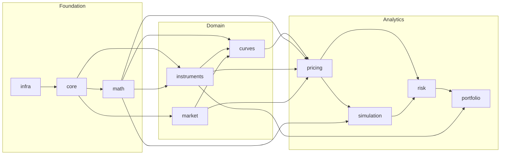

# Module Dependencies

This document defines the exact dependency relationships between JAQL modules.
These relationships are **architectural constraints** — they are not just conventions.
They are enforced by CMake target declarations and verified during CI.

---

## Dependency Graph



---

## Dependency Table

The table below lists, for each module: the modules it **may** depend on, and the modules
it **must not** depend on. Violations are build errors.

| Module        | May depend on                                          | Must NOT depend on                              |
|---------------|--------------------------------------------------------|-------------------------------------------------|
| `infra`       | *(nothing — no JAQL deps)*                             | `core`, `math`, any domain or analytics module  |
| `core`        | `infra`                                                | `math`, any domain or analytics module          |
| `math`        | `core`, `infra`                                        | Any domain or analytics module                  |
| `instruments` | `core`, `math`, `infra`                                | `market`, `curves`, any analytics module        |
| `market`      | `core`, `infra`                                        | `math`, `instruments`, `curves`, any analytics  |
| `curves`      | `math`, `instruments`, `market`, `core`, `infra`       | Any analytics module                            |
| `pricing`     | `curves`, `instruments`, `market`, `math`, `core`, `infra` | `simulation`, `risk`, `portfolio`           |
| `simulation`  | `pricing`, `math`, `core`, `infra`                     | `risk`, `portfolio`                             |
| `risk`        | `pricing`, `simulation`, `core`, `infra`               | `portfolio`                                     |
| `portfolio`   | `risk`, `instruments`, `core`, `infra`                 | *(top-level analytics — no restrictions)*       |

---

## Dependency Rationale

### Why does `market` not depend on `math`?

Market data observables (`Quote<T>`, `MarketData`) are **data containers**, not
mathematical constructs. Keeping `market` free of `math` ensures that the market data
abstraction can be used in contexts where only raw data is needed, without pulling in
any numerical infrastructure. Numeric operations on market data belong in `curves` or
`pricing`, which sit above both.

### Why does `instruments` depend on `math` but `market` does not?

Instrument definitions (cashflow schedules, day count fractions, notionals) frequently
involve numeric computations — for example, computing accrual fractions or deriving
derived quantities. Market data, by contrast, is a pure data layer: it stores and
provides observables, it does not compute with them.

### Why does `simulation` depend on `pricing` but not vice versa?

Simulation generates paths and calls the pricing engine to value instruments along those
paths. The pricing engine must not know about path generation — it values instruments
at a given market state. This separation means pricing engines can be used in isolation
(single-scenario pricing, calibration) without the full simulation infrastructure.

### Why does `risk` depend on both `pricing` and `simulation`?

Risk measures require both deterministic sensitivities (finite difference bumping via
the pricing layer) and probabilistic measures (scenario PnL distributions via the
simulation layer). `risk` orchestrates both.

---

## Enforcement Strategy

### CMake Enforcement

Every module's `CMakeLists.txt` calls `jaql_add_module()` and declares only its direct
dependencies in `DEPS`. The `jaql_add_module` helper translates these into
`target_link_libraries(... PRIVATE jaql::<dep>)` calls. Linking to an undeclared module
is a CMake configure error.

```cmake
# src/pricing/CMakeLists.txt
jaql_add_module(
    pricing
    DEPS core math instruments market curves
    # simulation, risk, portfolio are intentionally absent
)
```

### Include-What-You-Use (Future)

When `include-what-you-use` (IWYU) is integrated into the CI pipeline, transitive
include violations will also be detected. Until then, code review is the enforcement
mechanism for include hygiene.

### Cycle Detection

CMake will produce a configure error if a dependency cycle is introduced. Additionally,
the CI `ci-gcc-debug` preset runs with CMake's `--graphviz` export to generate a dependency
graph that is checked against the reference diagram above.

---

## Adding a New Module

When adding a new module `foo`:

1. Create `src/foo/CMakeLists.txt` calling `jaql_add_module(foo DEPS ...)`.
2. Create `include/jaql/foo/` for public headers.
3. Update `src/CMakeLists.txt` to `add_subdirectory(foo)` in the correct topological
   position.
4. Update this document's dependency table and graph.
5. Commit and push. CI will verify no dependency cycles are introduced.

The module must be placed at the correct layer (Foundation, Domain, or Analytics) and
must declare only dependencies consistent with its layer. If the required dependency
would violate the layer constraint, reconsider the module's placement or whether the
functionality belongs in a different module.
