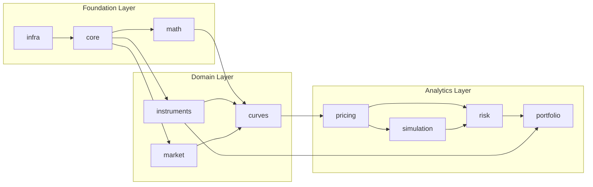

# Architecture Overview

## Vision

JAQL is a modular C++23 quantitative finance platform designed as a long-term engineering
asset. The architecture is built around three core tenets:

1. **Correctness over convenience** — Financial computations have real-world consequences.
   Numerical precision, type safety, and predictable error paths take precedence over
   development speed.

2. **Explicit over implicit** — Dependencies, ownership, and error propagation must be
   obvious from reading the code. Runtime behaviour should not depend on hidden global
   state or implicit conversions.

3. **Measured performance** — Optimization is applied where profiled and justified. The
   architecture provides hooks for performance-critical paths without polluting the general
   design with premature complexity.

---

## System Context



---

## Layer Responsibilities

### Foundation Layer

The foundation layer provides zero-dependency primitives that all higher layers build upon.
It has **no knowledge of financial concepts**. It must compile with no JAQL module
dependencies beyond itself.

| Module  | Responsibility                                                       | Key Abstractions              |
|---------|----------------------------------------------------------------------|-------------------------------|
| `infra` | Logging, system configuration, platform abstraction                  | `Logger`, `LogLevel`          |
| `core`  | Version info, error model, strong type primitives, assertions        | `Result<T>`, `StrongType<>`, `Error` |
| `math`  | Compile-time constants, numeric utilities, linear algebra bridge     | `constants::pi`, `approx_equal`, `lerp` |

### Domain Layer

The domain layer encodes financial abstractions. It models **what** financial objects are,
not **how** they are priced or simulated. Domain modules have no dependency on analytics.

| Module        | Responsibility                                                       | Key Abstractions              |
|---------------|----------------------------------------------------------------------|-------------------------------|
| `instruments` | Financial instrument concepts, cashflow definitions, leg structures  | `Instrument`, `Cashflow`      |
| `market`      | Market data observables, quote types, market snapshot concept        | `MarketData`, `Quote<T>`      |
| `curves`      | Yield curve concepts, day count conventions, term structures         | `YieldCurve`, `DayCountConvention` |

### Analytics Layer

The analytics layer contains algorithms that operate on domain objects to produce results.
These modules are algorithm-focused and depend on the domain layer, never on each other
unless there is a strict ordering (simulation → risk).

| Module       | Responsibility                                                       | Key Abstractions              |
|--------------|----------------------------------------------------------------------|-------------------------------|
| `pricing`    | Pricing engine framework, result types, PV computation               | `PricingEngine`, `PricingResult` |
| `simulation` | Monte Carlo framework, scenario generation, path simulation          | `Scenario`, `MonteCarloEngine` |
| `risk`       | Risk measure computation, sensitivity analysis, stress testing       | `RiskMeasure`, `Greeks`       |
| `portfolio`  | Portfolio aggregation, PnL attribution, cross-asset analytics        | `Portfolio`, `PortfolioView`  |

---

## Dependency Rules

The following rules are **hard constraints** enforced by CMake target dependency
declarations and verified in CI:

1. A module may only `#include` headers from modules in strictly lower layers.
2. No circular dependencies are permitted at any scope — module, file, or type.
3. Foundation modules (`infra`, `core`, `math`) must never include domain or analytics
   headers.
4. Domain modules must never include analytics headers.
5. Each module's public API lives under `include/jaql/<module>/` and is self-contained:
   no public header may require a transitive-only include to compile.
6. The `detail/` subdirectory under each module's source tree is private and must never
   be included by other modules.

See [Module Dependencies](module-dependencies.md) for the full dependency graph.

---

## Extension Points

JAQL is designed to be extended without modifying existing code (Open/Closed Principle):

### Pricing Engine Extension

New pricing engines implement the `PricingEngine` concept (a C++23 constrained template).
They are composed with instrument types at the call site. No virtual dispatch, no engine
registry, no base class required.

```cpp
// Any type satisfying the PricingEngine concept works
auto result = engine.price(bond, market_data);  // statically dispatched
```

### Instrument Extension

New instrument types satisfy the `Instrument` concept. Custom cashflow generation is
provided by implementing the concept interface. Existing pricing engines that are
constrained on `Instrument` automatically work with any conforming type.

### Market Data Backends

The `market` module defines the `MarketData` concept. Alternative backends
(in-memory, database-backed, real-time feed) implement the concept without touching
the pricing layer. The pricing engine is templated on the market data type.

### Curve Interpolators

New interpolation methods for yield curves satisfy the `Interpolator` concept and plug
into the curve construction framework without modifying existing curve types.

### Random Number Generators

The simulation module abstracts over RNG via a concept. Quasi-random sequences (Sobol,
Halton), MKL VSL, or any other generator satisfying the concept are drop-in replacements
for `std::mt19937`.

---

## Future Scalability

The following architectural decisions were made with future scalability in mind:

| Concern                  | Current Approach                     | Future Extension Path              |
|--------------------------|--------------------------------------|------------------------------------|
| Concurrency              | Single-threaded pricing engines      | Task-parallel engine dispatch      |
| GPU compute              | CPU-only simulation kernels          | Concept-abstracted compute backend |
| Distributed compute      | In-process only                      | Remote task queue via `infra`      |
| Serialization            | In-memory only                       | Flatbuffers/Protobuf adapter       |
| Persistent market data   | In-memory snapshot                   | Time-series database backend       |
| Calibration              | Manual parameter passing             | Optimizer framework (Phase 4)      |

---

## Non-Goals

The following are explicitly outside the scope of the initial architecture:

- **GUI or visualization** — JAQL outputs data. Plotting is handled by external tools
  consuming JSON or CSV output.
- **Order management / execution** — JAQL is an analytics library, not a trading system.
- **Real-time data feed adapters** — The market data abstraction supports live data as a
  future backend, but no vendor adapters are bundled.
- **GPU compute kernels** — The simulation module is designed to be GPU-extensible,
  but no CUDA/ROCm code is included initially.
- **Distributed compute** — Infrastructure hooks are documented in Phase 4+, but no
  MPI/gRPC integration is included at this stage.
