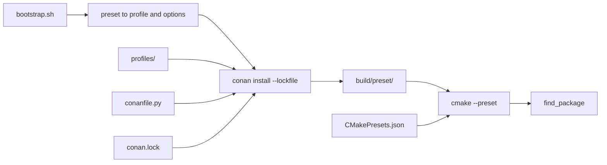

# Build System

JAQL uses **Conan 2** (consumer mode) for third-party dependencies and **CMake 3.25+**
with **CMake Presets v7** for configure/build/test. Module code never calls Conan APIs;
the root `CMakeLists.txt` uses standard `find_package()`.

See also [ADR-0001](adr/ADR-0001-conan2-package-manager.md) for the original decision.

---

## Quick Start

```bash
python3 -m pip install --user 'conan>=2.4,<3'
./scripts/bootstrap.sh
cmake --build --preset gcc-debug
./scripts/test.sh
```

`bootstrap.sh` runs `conan install` into `build/<preset>/`, then `cmake --preset <preset>`.

---

## Local Conan Cache

The repository root [`.conanrc`](../.conanrc) sets `conan_home=./.conan2`, so the Conan
**package cache** lives inside the project instead of `~/.conan2`. The directory is
gitignored — it is not source code.

Verify from the repository root:

```bash
conan config home
# Expected: /path/to/jaql/.conan2
```

To reuse an existing global cache:

```bash
mv ~/.conan2 .conan2
./scripts/bootstrap.sh
```

CMake install output (toolchain, `CMakeDeps`, `compile_commands.json`) still goes to
`build/<preset>/` — only the binary package cache moves.

**CI** continues to cache `~/.conan2` on GitHub Actions runners; no `.conanrc` is required
there.

---

## End-to-End Flow



Each CMake preset gets an isolated directory under `build/<preset>/` containing:

- `conan_toolchain.cmake` — compiler, flags, `CMAKE_PREFIX_PATH`
- Per-package `*-config.cmake` files from `CMakeDeps`
- The Ninja build tree and `compile_commands.json`

---

## Conan Consumer Recipe

[`conanfile.py`](../conanfile.py) at the repository root is a **consumer-only** recipe.
It does not implement `build()`, `package()`, or `layout()` — JAQL is built by CMake, not
published as a Conan package.

### Runtime requirements (`requirements()`)

Direct third-party libraries used by JAQL modules:

| Package | Version |
|---------|---------|
| tl-expected | 1.2.0 |
| spdlog | 1.17.0 |
| eigen | 5.0.1 |
| nlohmann_json | 3.12.0 |

### Build and test requirements (`build_requirements()`)

| Package | Version | When installed | Mechanism |
|---------|---------|----------------|-----------|
| doxygen | 1.17.0 | `build_docs=True` | `tool_requires` |
| gtest | 1.17.0 | `build_tests=True` | `test_requires` |
| benchmark | 1.9.5 | `build_benchmarks=True` | `test_requires` |

### Conan options

| Option | Default | Purpose |
|--------|---------|---------|
| `build_docs` | False | Install Doxygen; set `DOXYGEN_EXECUTABLE` and `JAQL_BUILD_DOCS` in toolchain |
| `build_tests` | True | Install GoogleTest |
| `build_benchmarks` | False | Install Google Benchmark |

Bootstrap maps CMake preset flags to these options automatically (for example, the
`benchmark` preset sets `build_tests=False` and `build_benchmarks=True`). Pass
`--docs` to enable `build_docs`.

Option syntax at the CLI: `-o "jaql/*:build_tests=True"`.

### Generators

- **`CMakeDeps`** — produces `find_package()`-compatible config files.
- **`CMakeToolchain`** (custom `generate()`) — writes `conan_toolchain.cmake`.
  `user_presets_path = False` keeps repository [`CMakePresets.json`](../CMakePresets.json)
  as the sole preset source.

---

## Profiles

Conan profiles live in the repository under [`profiles/`](../profiles/):

| Profile | Use case |
|---------|----------|
| `profiles/ci/gcc13` | GCC 13, libstdc++11, C++23 |
| `profiles/ci/clang17-libcxx` | Clang 17, libc++, C++23 |

Profiles intentionally omit `build_type`. Bootstrap passes
`-s build_type=Debug|Release` derived from the CMake preset and
`-s:b build_type=Release` for the build profile so tool_requires (Doxygen, CMake)
resolve to prebuilt binaries instead of source builds with an unset build type.

### Preset → profile mapping

Unless overridden, bootstrap selects:

| CMake preset family | Host profile |
|---------------------|--------------|
| `gcc-*`, `ci-gcc-*`, `asan`, `ubsan`, `tsan`, `benchmark` | `profiles/ci/gcc13` |
| `clang-*`, `ci-clang-*` | `profiles/ci/clang17-libcxx` |

Override with `--host-profile` / `--build-profile`, or
`JAQL_CONAN_HOST_PROFILE` / `JAQL_CONAN_BUILD_PROFILE`.

To use your machine-detected compiler instead of CI profiles, pass
`--host-profile default` (bootstrap runs `conan profile detect` if needed).

See [`profiles/local/README.md`](../profiles/local/README.md) for local development notes.

**Profile ordering:** In Conan profile files, set `compiler=` before `compiler.cppstd=`.

---

## Lockfile

[`conan.lock`](../conan.lock) pins the resolved dependency graph (including transitive
packages such as `fmt`). Bootstrap and CI use:

```bash
conan install . --lockfile conan.lock --lockfile-partial ...
```

`--lockfile-partial` allows profile-specific binaries while keeping versions fixed.

### Regenerating the lockfile

After changing direct dependencies in `conanfile.py`, rebuild the lockfile in stages so
every bootstrap configuration is covered. Conan 2 stores `test_requires` (gtest,
benchmark) under `requires`, and `tool_requires` (cmake, doxygen) under
`build_requires`.

**1. Default bootstrap** (`build_tests=True`, used by CI and daily dev):

```bash
conan lock create . \
  -pr:h=profiles/ci/gcc13 \
  -pr:b=profiles/ci/gcc13 \
  -s build_type=Debug \
  -s:b build_type=Release \
  -o "jaql/*:build_tests=True" \
  -o "jaql/*:build_benchmarks=False" \
  -o "jaql/*:build_docs=False" \
  --lockfile-out=conan.lock
```

**2. Docs bootstrap** (`--docs`):

```bash
conan lock create . \
  -pr:h=profiles/ci/gcc13 \
  -pr:b=profiles/ci/gcc13 \
  -s build_type=Debug \
  -s:b build_type=Release \
  -o "jaql/*:build_tests=True" \
  -o "jaql/*:build_benchmarks=False" \
  -o "jaql/*:build_docs=True" \
  --lockfile conan.lock \
  --lockfile-out=conan.lock
```

**3. Benchmark preset** (optional):

```bash
conan lock create . \
  -pr:h=profiles/ci/gcc13 \
  -pr:b=profiles/ci/gcc13 \
  -s build_type=Release \
  -s:b build_type=Release \
  -o "jaql/*:build_tests=False" \
  -o "jaql/*:build_benchmarks=True" \
  -o "jaql/*:build_docs=False" \
  --lockfile conan.lock \
  --lockfile-out=conan.lock
```

Commit the updated `conan.lock` with the dependency change.

---

## CMake Integration

### Presets

[`CMakePresets.json`](../CMakePresets.json) defines configure/build/test presets. The
hidden `base` preset wires the Conan toolchain:

```json
"toolchainFile": "${sourceDir}/build/${presetName}/conan_toolchain.cmake"
```

Common presets:

| Preset | Build type | Notes |
|--------|------------|-------|
| `gcc-debug` | Debug | ASan + UBSan, tests on |
| `clang-debug` | Debug | ASan + UBSan, tests on |
| `benchmark` | Release | Benchmarks on, tests off, LTO |
| `ci-gcc-debug` | Debug | Coverage + Werror |
| `ci-clang-debug` | Debug | Werror |

### Root dependency wiring

[`CMakeLists.txt`](../CMakeLists.txt) calls `find_package()` for Conan-provided targets.
Module `CMakeLists.txt` link via `jaql_add_module(DEPS ...)` — no Conan references.

### Scripts

| Script | Purpose |
|--------|---------|
| [`scripts/bootstrap.sh`](../scripts/bootstrap.sh) | Conan install + CMake configure |
| [`scripts/test.sh`](../scripts/test.sh) | `ctest --preset` |
| [`scripts/lint.sh`](../scripts/lint.sh) | clang-tidy using `compile_commands.json` |
| [`scripts/check_headers.sh`](../scripts/check_headers.sh) | Standalone header compiles via Conan toolchain |

---

## Dependency Graph Policy

### Adding a dependency

1. Add to `conanfile.py` under `requires()` (or conditional `build_requirements()`).
2. Add `find_package()` in root `CMakeLists.txt`.
3. Link in module `CMakeLists.txt` via `jaql_add_module(DEPS ...)`.
4. Regenerate `conan.lock`.
5. Document in [`docs/tech-stack.md`](tech-stack.md).

### Overrides, visibility, and package options

The current graph is small and has no version conflicts. Do **not** add overrides
preemptively. When `conan graph info .` reports a conflict, use:

| Mechanism | When to use |
|-----------|-------------|
| `self.requires("pkg/version", override=True)` | Force a transitive version (e.g. conflicting `fmt` versions pulled by spdlog and another library) |
| `self.requires("pkg/version", visible=False)` | Hide an implementation-only dependency from downstream consumers (relevant if JAQL is ever packaged via Conan) |
| Requirement options, e.g. `self.requires("spdlog/1.17.0", options={"header_only": True})` | Forward upstream package configuration |

Inspect the graph before and after:

```bash
conan graph info . -pr:h=profiles/ci/gcc13 -s build_type=Debug
```

---

## CI

[`.github/workflows/ci.yml`](../.github/workflows/ci.yml) uses repository profiles,
`conan.lock`, and `conan>=2.4,<3`. CI caches Conan packages under `~/.conan2`, keyed on
`conanfile.py` and `conan.lock` hashes. Local development uses `./.conan2` via
[`.conanrc`](../.conanrc) instead.

---

## Troubleshooting

| Symptom | Likely cause | Fix |
|---------|--------------|-----|
| `conan_toolchain.cmake` not found | CMake configured before Conan install | Run `./scripts/bootstrap.sh --preset <preset>` |
| ABI/link errors with Clang preset | Wrong Conan profile (GCC binaries with Clang compiler) | Use `--preset clang-debug` (auto-selects `profiles/ci/clang17-libcxx`) or pass `--host-profile profiles/ci/clang17-libcxx` |
| Lockfile version mismatch after dep bump | Stale `conan.lock` | Regenerate lockfile (see above) |
| `'settings.compiler' value not defined` | Invalid profile field order | Set `compiler=` before `compiler.cppstd=` in profile files |
| Wrong cache used / stale packages | Running Conan outside repo root | Run commands from repo root so `.conanrc` is found; check `conan config home` |
